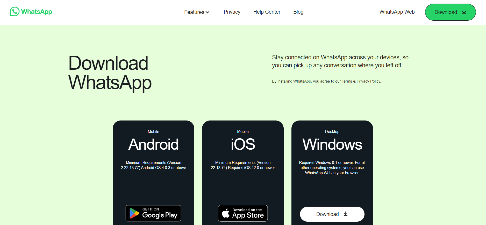
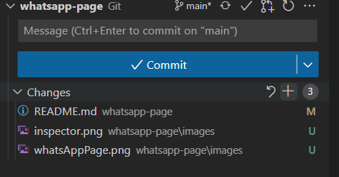
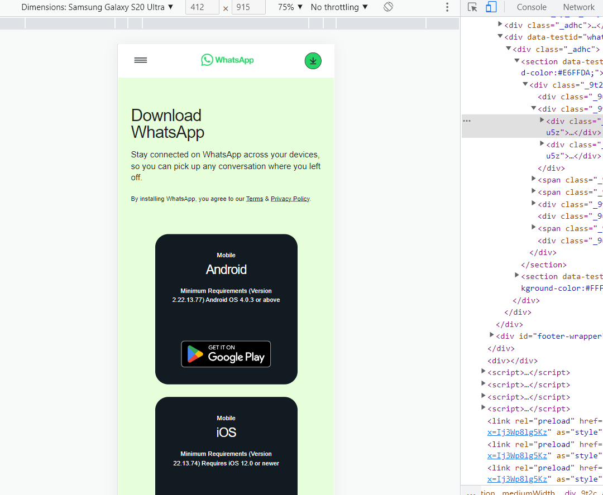

# Reproduction of WhatsApp download page 

Here you will learn how to reproduce a page [https://www.whatsapp.com/download/] using html and css (no functionality required)

## Steps

- Clone this repo:
 - click the green Code button in github, copy the URL
 - open the Visual Studio Code in your learning folder and and write in terminal `git clone paste_your_url_here`
- create a separate branch `git switch -c "dev"`
- add html and css files and code
- in VS Code, click on html file and Go Live (plugin installed previously) to avoid refreshing the page on changes
- when you're done coding, add the changes to staging using + button in VS Code Source Control tab or type on terminal `git add .`
 
- commit and push the code `git commit -am "commit message here"`, `git push -u origin dev`
- go to github and raise a pull request from your development branch to master
 

## Requirements

- style the page for desktop viewing, but if you have time make it responsive (use the inspector to test the look on mobile devices)
- use any css rules you want
 
- if you need to upload images to your repo, place them all inside the images folder
- use English everywhere (page, variables naming, comments, commit messages)